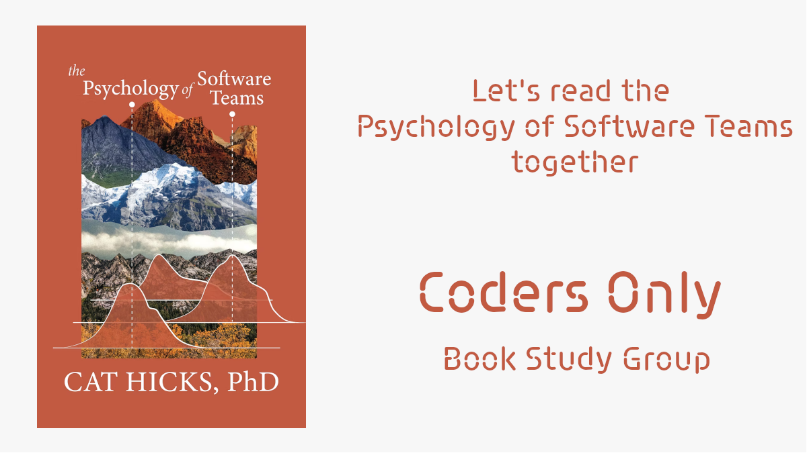
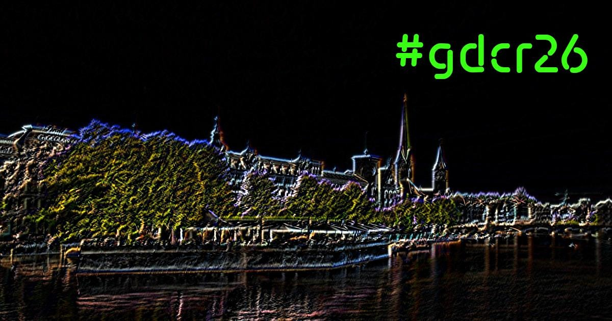
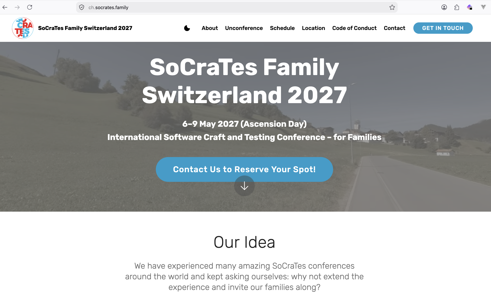

<!-- _class: centered -->


--

## Who are we?

# Coders Only

We are a registered association in Zürich dedicated to software crafters, testers, admins...

---

# What do we do?

- SoCraTes Day CH
- Global Day of Coderetreat Zürich
- Book study groups (like Psychology of Software Teams)
- Software Craft Study Group
- Girl Coders get together
- Coders Monthly
- Regular meetups

---



---
<!-- _class: sponsors -->

# Sponsoren

 
 

---

## Become a member

```shell
$ sh <(curl -L https://codersonly.org/members/join)
```

---

## hashtag: #SoCraTesZurich

---

# Practical points

- Toilets
- Lunch
- Coffee
- Beverages
- Smoking

---

# Marketplace

Take post-its and write on them something

- you'd like to show
- you'd like to discuss
- you are curious about

pitch them (30 seconds) and find a slot on the board

Put your name on the post-it!

---

# Rescheduling at the end

only with the permission of the owner of the session!

# Sizing/Rooms:

all indicate with a dot their 6'ish favourite sessions
-> Possibility to change rooms

---

## Rules during the day and sessions

- Bumblebees and Butterflies - Learn, contribute or walk away.
- Law of 2 Feet - Go to a place where you can learn or share.
- Whoever comes are the right people.
- It starts when it starts. When it's over it's over.
- Aim for finishing 5 Minutes before the next session.

---

## Agenda

| Time     | Event                   |
|----------|-------------------------|
| 09       | Welcome and Marketplace |
| 10 to 13 | Sessions                |
| 13       | Lunch                   |
| 14 to 17 | Sessions                |
| 17       | Closing / Feedback      |

---

# Have fun!!

---

<!-- _class: centered -->


---

# Closing Session

---

# Feedback

---

# Thankyou

---


<!-- _class: sponsors -->

# Sponsoren

 
 

---

## Become a member

```shell
$ sh <(curl -L https://codersonly.org/members/join)
```

---


<!-- _class: centered -->

# Global Day of Coderetreat

## Saturday, 7th November 2026



---

<!-- _class: centered -->

# January, 28th to 31st, 2027


https://socrates-ch.org

---

<!-- _class: centered -->

# May, 6th to 9th, 2027



https://ch.socrates.family

---

## Join the cleanup session!

# 🧼✨🫧🧹🧽🗑️

(wipe boards, rearrange chairs, tables, etc.)
